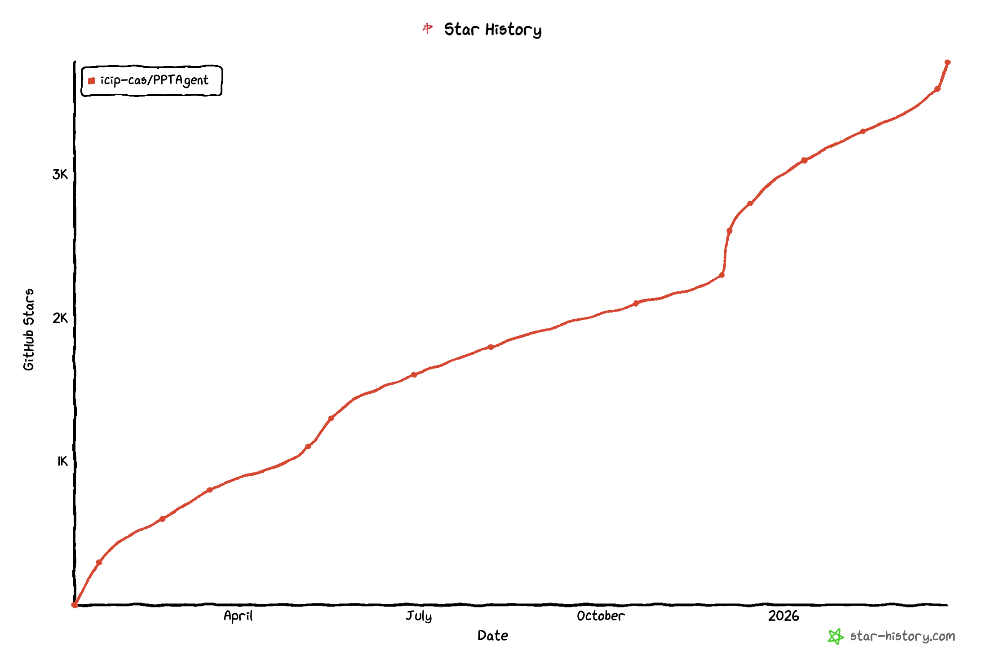
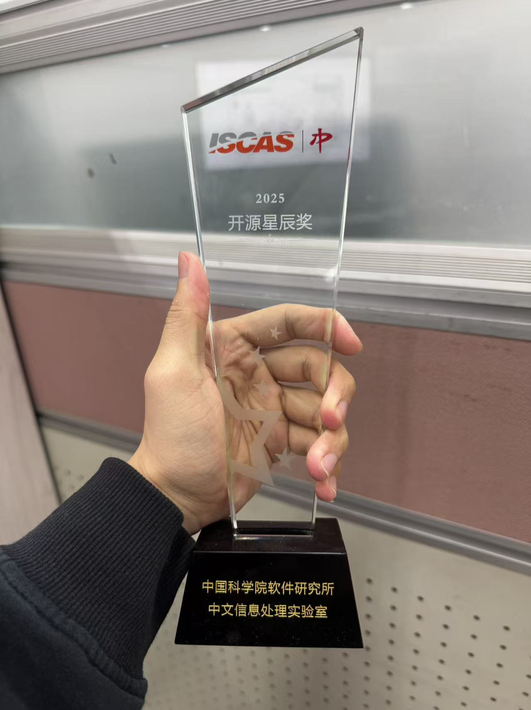

> 前几天看到 BettaFish 作者 @BaiFu 分享开源项目如何改变了他的生活。虽然我没有 BaiFu 那么厉害，但也想聊聊自己这几年开发、维护一个项目的酸甜苦辣

**TOC:**
1. PPTAgent：飞来横「火」
2. DeepPresenter：浴火重生
3. Bitter Lessons：经验与教训

前几天刷到 BettaFish 作者的分享——他说一个开源项目可以改变人生

我第一反应是：好像确实如此，但也没那么简单

因为我也做过一个"爆过"的项目。从 0 到几百 star，只用了几天；但后面两年，我一直在为它补课

---

# PPTAgent：爆火带来的是什么

这个项目最开始，其实挺随意的

2024 年末，导师让我试试：
👉 用大模型做自动生成 PPT

彼时，智能体的形态还没有定论。写代码勉强还行，但让它设计一份"能看的 PPT"，基本不可能

我没有去硬解这个问题，而是选了一个更"取巧"的方式——不从零生成，而是在已有 PPT 上做编辑。这样既能借助已有模板的设计质量，又能满足遵循制定模版的需求

它很粗糙，尽管从实验上来看还是取得了一定的效果，但还远远达不到可以实用的标准

当我把项目开源到 GitHub、挂上 arXiv 时，意想不到的事情发生了

100, 200, 300！stars 数快速飞升着，刚开始的几天睡前看一眼仓库我就整宿睡不着

项目有了关注之后，出于各种原因，我开始投入大量时间去“完善它”：改 prompt、调 workflow、补各种边界情况，希望让它更稳定、更好用

但几个月后回头看，我逐渐意识到一个问题：**这些优化并没有带来本质上的提升。项目变得更复杂了，但没有变得更"有用"。**

---

# DeepPresenter：浴火重生

2025 年起，ReAct Agent 逐渐成为智能体的标准范式。我越来越相信一个道理：*less is more for agency*。当我们用过多的工作流和 prompt 工程去"约束"模型时，往往适得其反——模型反而无法充分发挥自己的思考与生成能力

这一次，我的目标更明确：做一个完全自主的幻灯片智能体，直面「资料搜集」、「沙盒环境」、「样式设计」等所有挑战

同时，我希望能有一个自己微调的模型来提供低成本、稳定的服务

过程是艰辛的：受限于当时基座模型的能力相当有限，微调后的模型仍然表现不佳，好几次我们差点放弃打造自己的智能体模型

好在尝试了多种方案和基座模型后，我在几位朋友的帮助下完成了早期验证。剩下的事情便水到渠成，随着数据工程的进一步完善，可以说我们终于做出了目前最好的幻灯片智能体小模型

项目最终受到了机器之心、软件研究所的报道，也有不少使用者给了我相当正面的反馈

遗憾的是，当项目开放之后，我发现来自 OpenClaw 的降维打击让它的关注度远不如预期

这也许就是时也命也

---

# 这三年，我的教训

1. **避免做 incremental work。** 小修小补很容易让人产生"在进步"的错觉，但本质上可能只是在原地打转

2. **拥有一个微调的智能体模型真的很重要。** 尤其是在 Cursor 利用 Kimi 微调一事曝光之后——设想一下，如果 Manus 有一个能达到闭源模型 95% 效果的私有模型，它的 DAU 和 ARR 还能提升多少？如果一个研究生的资源就能支撑微调一个私有模型，为什么不试试呢？

3. **不要给自己的可能性上枷锁。** 不要觉得自己"做不到"。很多以前认为麻烦、耗时的东西，在 Code Agent 的帮助下只需要一个下午

4. **如果设计是合理的，不要强求框架能被开源模型完美运行。** 先为最强的模型设计，再向下兼容

5. **用简单的方法、困难的方式，去解决有挑战的问题。** 方法要简洁，但不要回避真正的难点

